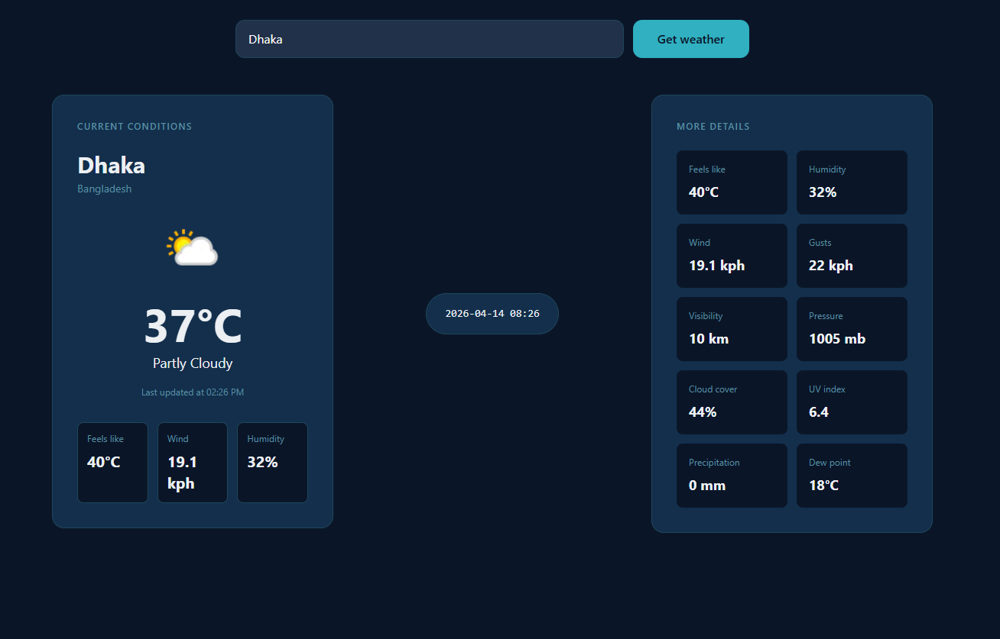

# 🌤️ React Weather App

This is my first React project, built during my course at Ostad. The application fetches real-time weather data from a third-party API and displays it in a clean and responsive user interface.

---

## 🚀 Features

- 🌍 Search weather by city name
- 🌡️ Real-time temperature display
- ☁️ Weather condition information
- ⚡ Fast API data fetching using Axios
- 📱 Responsive UI with Tailwind CSS
- ❌ Error handling for invalid city or network issues

---

## 🛠️ Tech Stack

- React
- JavaScript (ES6+)
- Axios
- Tailwind CSS
- REST API (Weather API)

---

## 📚 What I Learned

- Understanding and using **React Hooks** (`useState`)
- Managing **component state**
- Making **API calls using Axios**
- Handling **asynchronous operations**
- Implementing **error handling**
- Building responsive UI using **Tailwind CSS**

---

## 🌐 Live Demo

👉 https://shafins-weather-app-react.onrender.com/

---

## 📸 Screenshot

## 📸 Screenshot

<p align="center">
  
</p>

---

## 💻 Installation & Setup

1. Clone the repository:
```bash
git clone https://github.com/Shafin98/your-repo-name.git

cd your-repo-name

npm install

npm run dev
